## 集群概况

* Broker 数量为4, 最低配置
* 消息格式为 "{Guid}#{index}", 由 Guid 和 For 循环当前数值以 # 拼接而成
* 消费队列缺省容量为 50 个, 达到时压缩发送

## 生产水平测试

### 2个连接

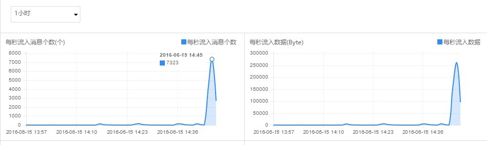

7300+ 消息/sec.; 25w Byte/sec. 数据写入;

### 4个连接

1.4w+ 消息/sec.; 50w Byte/sec. 数据写入;

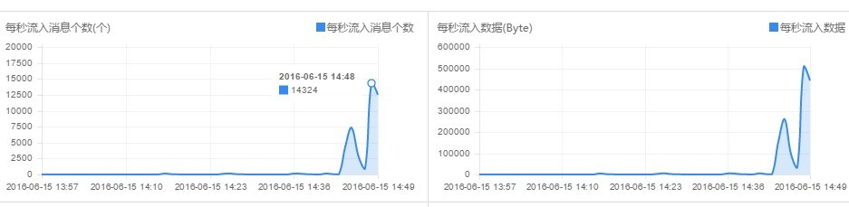

### 32 个连接

9w+ 消息/sec.; 317w Byte/sec. 数据写入, 合约 3 MB/sec.; 

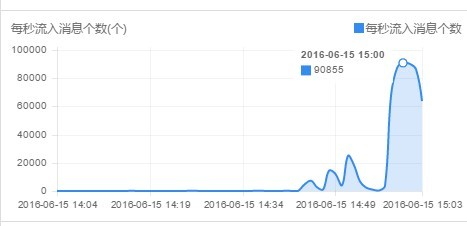

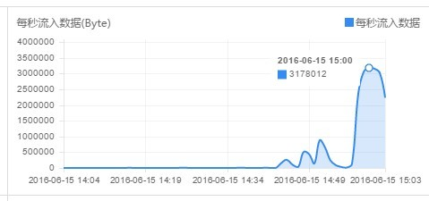

网卡发送水平在 30 Mbps 左右, CPU 100%;

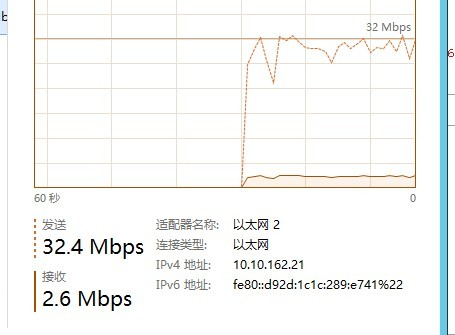

Zabbix 监控印证

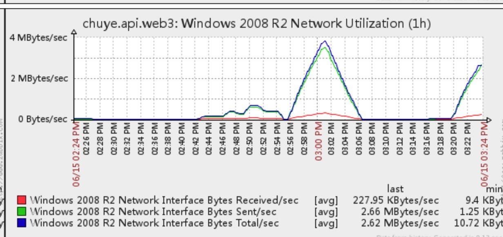

### 64 个连接

32 个连接时客户机 CPU 已满，另开一台客户机测试 64 个连接的水平;

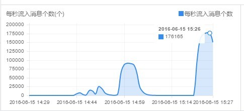

17.6w+ 消息/sec.; 618w+ Byte/sec. 数据写入, 合约 5.9 MB/sec.

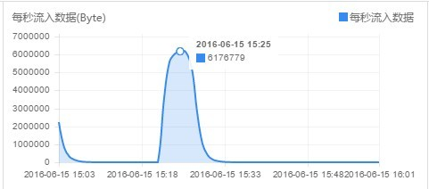

## 消费水平测试

测试期间产生数据 1y 左右, 消费水平测试准备并不充分，以下所提及时间为估算

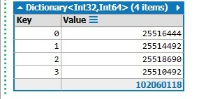

启动1个消费者, 独占了4个分区

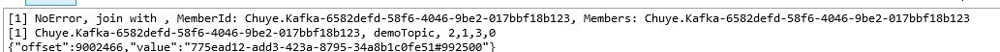

加入1个消费者, 4个分区自动平均分配

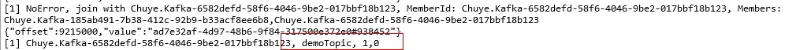

百w/消费/分钟的水平，流量在 10 MB/sec. 左右，

重置消费进度，使用4个消费者从头开始消费全部的1亿条，

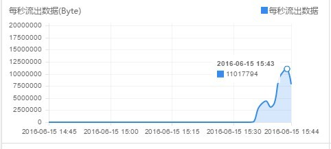

5分钟左右消费完，500w/消费者/分钟的水平，流量是 15 MB/sec.，

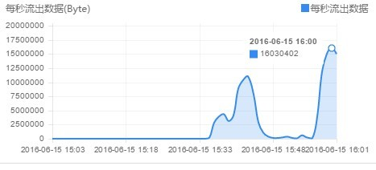

更多消费者的不再测试，因为分区无法继续分摊给多出来的消费者
